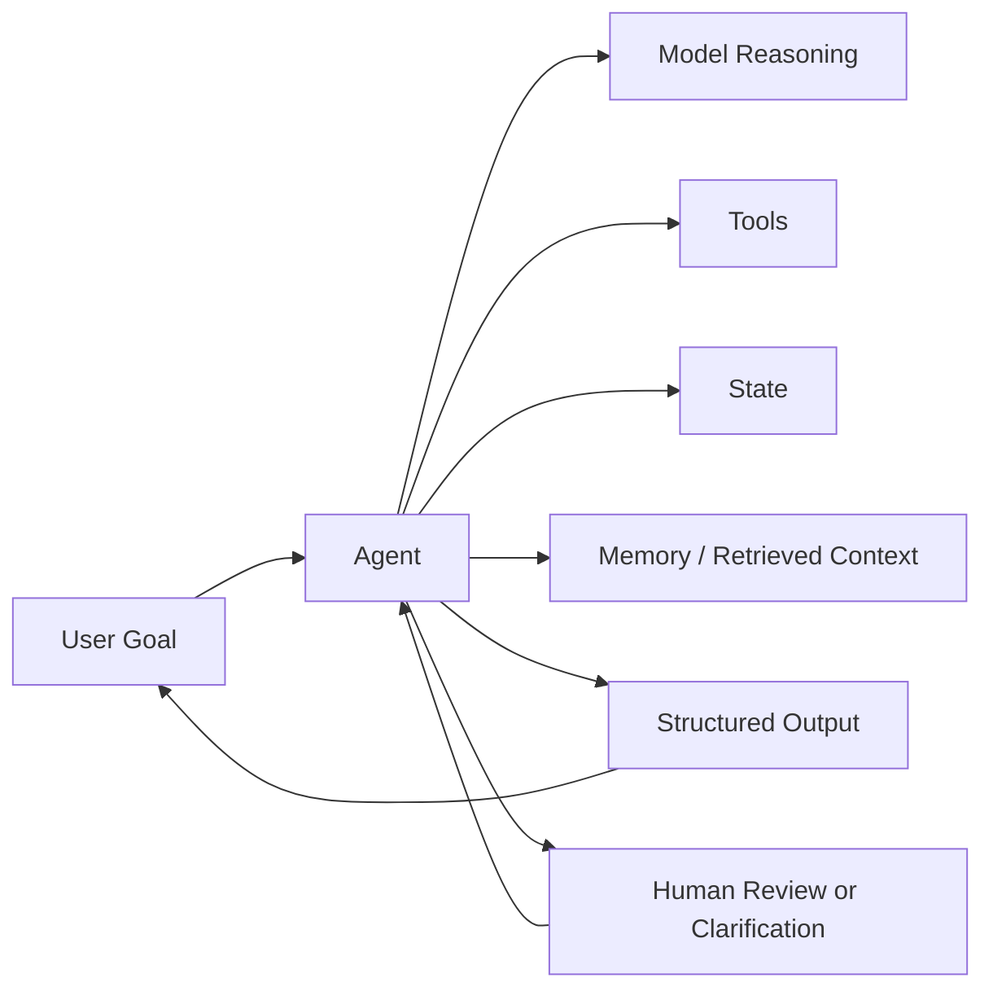

# 02 Concepts

这一章的目标不是堆术语，而是把后面所有阶段都会反复使用的几个基础概念讲清楚。

## 1. Agent 不是一句提示词，而是一套系统

在这套课程里，`Agent` 指的是一个围绕目标运行、能理解上下文、能调用能力、能在必要时暂停并把结果交付出去的系统。

它通常包含这些层:

- 模型: 负责理解和生成
- 指令: 规定角色、边界、输出要求
- 输入: 用户问题、任务描述、上下文材料
- 工具: 搜索、数据库、文件、浏览器、业务 API
- 状态: 当前做到哪一步、已经拿到什么中间结果
- 记忆: 跨轮或跨会话保留的信息
- 输出结构: 让系统结果能被人或程序消费
- 反馈回路: 失败、澄清、审批、重试与交接

可以把它理解成下面这个环:

这张图里最重要的不是“模型”，而是 `Agent` 作为一个协调系统的角色。模型只是其中一层，不是全部。

## 2. Agent 和聊天机器人到底差在哪

一个普通聊天机器人更关注 “回答质量”；一个 Agent 更关注 “任务完成机制”。

对比可以这样看:

| 维度 | 聊天机器人 | Agent |
| --- | --- | --- |
| 核心目标 | 更好地回答 | 更稳定地完成任务 |
| 是否需要工具 | 通常不需要 | 经常需要 |
| 是否需要状态 | 通常很少 | 经常需要 |
| 是否有流程 | 常常没有 | 通常有 |
| 是否要暂停等人确认 | 不一定 | 很常见 |
| 评判标准 | 回答像不像样 | 任务是否真的完成 |

一个很实用的判断句:

> 如果系统只需要解释、总结、改写，且不需要外部动作、状态管理或流程控制，它往往还不需要被设计成 Agent。

## 3. 不是什么需求都值得做成 Agent

新手最常见的误区之一，是把 “能用模型做” 自动等同于 “应该做成 Agent”。

下面这几类需求，往往不需要一上来就做成 Agent:

- 固定模板改写
- 单轮问答
- 纯内容生成
- 没有工具、没有状态、没有流程的助手

而下面这些需求，更像 Agent 场景:

- 需要访问外部世界
- 需要多步完成
- 需要根据中间结果改变下一步动作
- 需要在关键节点向用户确认
- 需要保留任务上下文或跨轮信息

这也是为什么 `Stage 1` 要先学“判断”，再学“实现”。

## 4. 工具是什么，为什么不是越多越好

工具是 Agent 与外部世界连接的桥。

常见工具包括:

- 搜索工具
- 文件读取工具
- 数据库查询工具
- 浏览器或网页访问工具
- 发送邮件、消息、工单的工具
- 企业内部业务 API

为什么要工具:

- 模型不知道实时信息
- 模型不能直接执行外部动作
- 模型输出必须落到真实系统里

但工具不是越多越好，因为每多一个工具，系统就多一层:

- 选择错误的风险
- 权限边界风险
- 调用失败风险
- 结果校验风险

所以一个成熟的设计思路是:

> 先证明某个工具是必要的，再把它加入系统；不要因为“以后可能会用到”就先接进去。

## 5. 状态是什么

状态是系统在执行过程中必须记住、否则流程就断掉的信息。

比如:

- 当前任务处于哪一阶段
- 哪些步骤已经完成
- 用户已经确认了什么
- 当前是否在等待审批
- 上一步工具返回了什么关键中间结果

状态的本质不是“保存一切”，而是:

> 保存足够的信息，让系统能从上一步继续，而不是每轮都像第一次见到这个任务。

没有状态时，系统常常会出现这些问题:

- 每轮都重新理解任务
- 忘记自己刚刚做过什么
- 无法安全恢复流程
- 看起来很灵活，实际很不可靠

## 6. 记忆和知识库不是一回事

很多初学者会把 `状态`、`记忆`、`知识库` 混在一起。实际它们解决的是不同问题。

| 概念 | 解决什么问题 | 典型例子 |
| --- | --- | --- |
| 状态 | 这次任务当前进行到哪 | 当前审批状态、当前计划、已完成步骤 |
| 短期记忆 | 当前会话里需要延续什么 | 用户刚刚澄清过的目标、上一轮给过的约束 |
| 长期记忆 | 跨会话保留什么 | 用户偏好、常用格式、长期角色信息 |
| 知识库 | 系统需要查什么外部材料 | 产品文档、课程资料、FAQ、内部 SOP |

LangChain 官方文档也明确把 memory 当成需要分层设计的系统能力，而不是“把所有历史拼进 prompt”。

参考:

- [Memory overview](https://docs.langchain.com/oss/python/concepts/memory)
- [Short-term memory](https://docs.langchain.com/oss/python/langchain/short-term-memory)
- [Long-term memory](https://docs.langchain.com/oss/python/langchain/long-term-memory)

对新手来说，最重要的结论是:

> “这条信息要保留” 不是一个实现决定，而是一个系统设计决定。你要先说明为什么保留，再决定保留到哪里。

## 7. Human-in-the-loop 不是锦上添花，而是边界设计

当 Agent 能“做事”以后，另一个问题就出现了:

> 哪些事它可以自己做，哪些事必须停下来让人看一眼。

这就是 `human-in-the-loop` 的意义。

通常需要人工确认的动作包括:

- 不可逆操作
- 会花钱的操作
- 对外发送内容
- 修改正式数据
- 删除、发布、审批类动作

在 LangChain / LangGraph 官方文档体系里，这不是可选装饰，而是系统能力的一部分。LangChain 提供了 human-in-the-loop 中间件，LangGraph 提供了 interrupt 机制来暂停和恢复流程。

参考:

- [LangChain human-in-the-loop](https://docs.langchain.com/oss/python/langchain/human-in-the-loop)
- [LangChain frontend human-in-the-loop](https://docs.langchain.com/oss/python/langchain/frontend/human-in-the-loop)
- [LangGraph interrupts](https://docs.langchain.com/oss/python/langgraph/interrupts)

## 8. Agent 的失败，不只是“回答错了”

新手很容易把失败理解成“模型 hallucination”。实际上，Agent 的失败类型远不止这一种。

更完整地看，常见失败包括:

- 目标理解失败
- 工具选择失败
- 中间结果校验失败
- 输出格式失败
- 流程推进失败
- 该暂停时没有暂停
- 该澄清时没有澄清
- 用户不知道系统现在在干什么

这意味着:

> 一个 Agent 的质量，不只是看它主路径能不能成功，还要看它失败时有没有体面、安全、可解释的退路。

## 9. 最小可行 Agent 的思路

`Stage 1` 非常强调 “最小可行”。

一个最小可行 Agent 通常有这些特点:

- 只有一个核心用户
- 只有一个核心任务
- 只有一条主路径
- 只接必要工具
- 只保留必要状态
- 明确哪些地方要先问人

很多失败不是因为系统太弱，而是因为第一版做得太大。

所以真正成熟的起点不是 “我要做一个很强的 Agent”，而是:

> 我要先做一个边界清楚、行为可解释、失败可收敛的最小版本。

## 10. 新手最容易犯的 8 个错误

1. 先堆功能，不先定目标。
2. 把提示词当成全部系统设计。
3. 用工具掩盖需求不清。
4. 不设计输出结构。
5. 不区分状态、记忆和知识库。
6. 不给高风险动作设审批。
7. 只看演示成功，不看失败路径。
8. 把“能跑一次”误当成“可以长期用”。

## 11. 这一章真正想让你记住的话

进入 `LangChain`、`LangGraph`、`Deep Agents` 之前，先记住这句话:

> 一个 Agent 项目首先是系统设计问题，其次才是框架实现问题。

如果这一句真正吃透了，后面的框架学习就会快很多，也稳很多。
